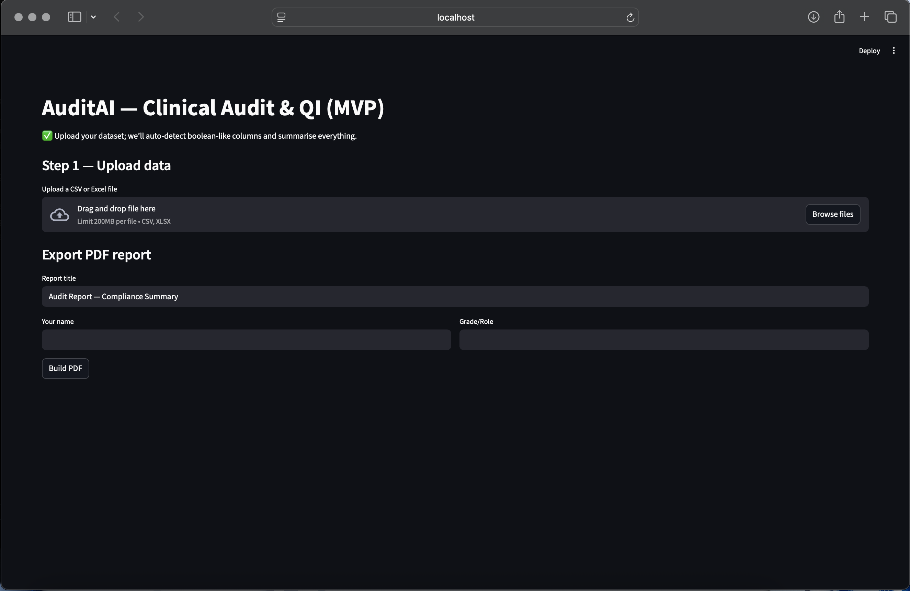
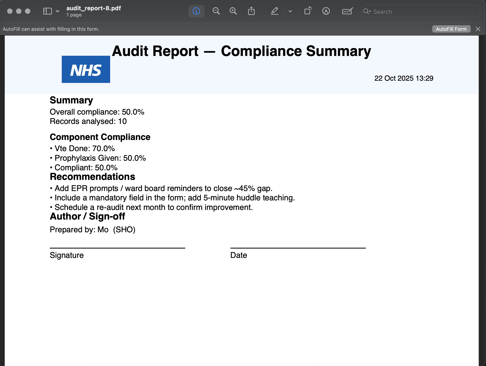

# 🩺 AuditAI — AI-Assisted Clinical Audit & QI Platform

<p align="center">


</p>

---

## 📘 Overview

**AuditAI** is a lightweight Streamlit application that helps doctors and clinical teams quickly perform **clinical audits** and generate **NHS-style PDF reports** for portfolio or governance submission.

The platform automatically:
- Detects *Yes/No* or *True/False* fields in uploaded datasets  
- Calculates **overall and per-component compliance**
- Generates **recommendations** based on results  
- Exports a **polished, NHS-branded PDF** including author details and signature section  

---

## 🧠 Why AuditAI?

Audits are crucial for improving patient care, but manual analysis and formatting take time.  
AuditAI automates these steps, allowing clinicians to focus on what really matters — implementing change.

---

## 🚀 Features

✅ Upload ward or clinic data (`.csv` / `.xlsx`)  
✅ Auto-detect Boolean columns and calculate compliance  
✅ Display data preview and metrics interactively  
✅ Generate improvement recommendations  
✅ Export professional **NHS-style PDF reports** including:
   - Title and summary
   - NHS logo header
   - Component compliance breakdown
   - Author / grade / signature section

---

## 🧩 Example Workflow

**Example dataset (VTE Audit):**
| patient_id | vte_done | prophylaxis_given | compliant |
|-------------|-----------|------------------|------------|
| P001 | Yes | Yes | Yes |
| P002 | No | No | No |
| P003 | Yes | No | No |

**Output summary:**
- Overall compliance: **50%**
- Records analysed: **10**
- Recommendations:  
  • Add EPR prompt or ward-board reminder  
  • Provide 5-minute huddle teaching  
  • Re-audit next month  

**Generated PDF:**
- NHS logo in header  
- Title centred  
- Date/time stamp  
- Signature and author section  
- Clean, portfolio-ready layout

---

## 🖼️ Preview

### 🔹 Streamlit App  
*(Upload data, view compliance, and export instantly)*  

### 🔹 Generated NHS-Style PDF  
*(Automatically formatted compliance summary)*  


---

## ⚙️ Installation

```bash
git clone https://github.com/M-Omarjee/Audit-AI.git
cd Audit-AI
python3 -m venv .venv
source .venv/bin/activate
pip install -r requirements.txt
streamlit run app/streamlit_app.py
```
Then visit 👉 http://localhost:8501

---

## 🧱 Project Structure
```
Audit-AI/
├── app/
│   ├── streamlit_app.py        # Main UI
│   ├── report_utils.py         # PDF generation logic
│   └── __init__.py
├── assets/
│   └── nhs.png                 # NHS logo for header
├── reports/                    # Auto-generated PDFs
├── requirements.txt
└── README.md
```

---

## 🩵 Future Roadmap

Add trend graphs and run-chart visualisation  
Integrate NICE guideline compliance mapping  
Deploy to Streamlit Cloud  
AI-based recommendation generation  
