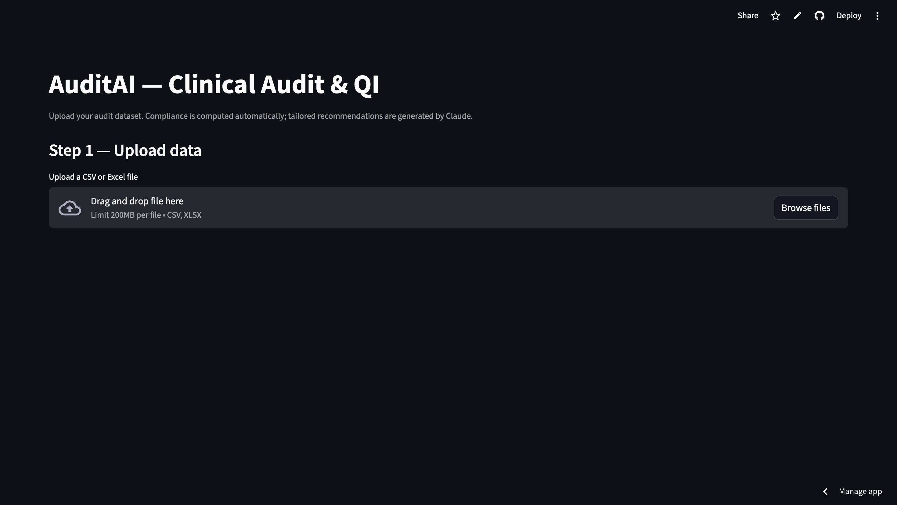
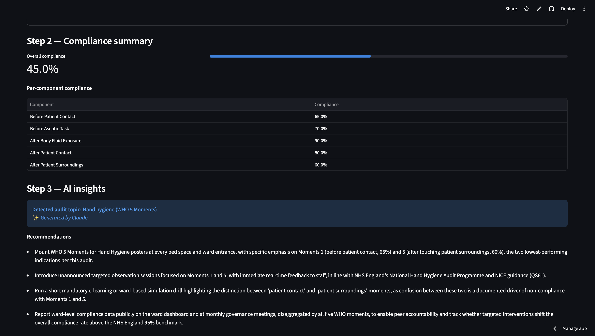
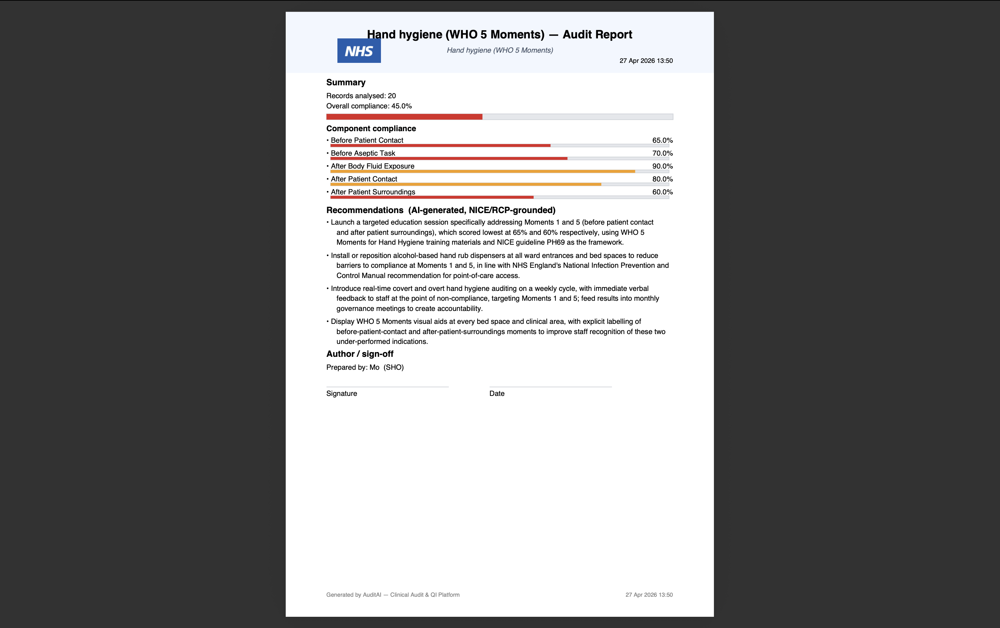

# AuditAI — AI-Powered Clinical Audit Assistant

[](https://audit-ai-mo.streamlit.app)
[](https://www.python.org/downloads/release/python-3110/)
[](https://www.anthropic.com/claude)
[](LICENSE)

A Streamlit app that turns a ward-level audit CSV into an NHS-styled PDF report — with **topic-aware, NICE/RCP-grounded recommendations generated by Claude**, not hardcoded boilerplate.

**🔗 Live demo:** [audit-ai-mo.streamlit.app](https://audit-ai-mo.streamlit.app)

Built by a foundation doctor who got tired of writing the same audit recommendations by hand.

---

## What it does

Upload a CSV / Excel of audit data → AuditAI:

1. **Auto-detects** the boolean compliance fields (Yes/No, True/False, 1/0)
2. **Computes** overall and per-component compliance with visual bars
3. **Detects the audit topic** from the column names (e.g. *"VTE risk assessment"*, *"Hand hygiene (WHO 5 Moments)"*, *"Inpatient medication prescribing"*)
4. **Generates 3-4 tailored recommendations** via Claude, citing the relevant UK guidance (NICE NG89, WHO 5 Moments, Royal Pharmaceutical Society, etc.)
5. **Exports an NHS-styled PDF** with summary, colour-coded compliance bars, AI recommendations, and a sign-off section

The whole flow takes ~10 seconds end-to-end.

<p align="center">
  
</p>

---

## The "AI" earns its name

Most "AI"-branded portfolio projects use hardcoded `if/else` recommendations dressed up in marketing language. AuditAI's recommendations are **generated per-audit by Claude Sonnet 4.6**, with the audit topic detected from column names.

### What the same compliance gap produces

For a VTE audit (`vte_done`, `prophylaxis_given`, `compliant`):

> *"Configure the EPR admission clerking template to include a mandatory VTE risk assessment field using the NICE-recommended tool (NICE NG89), preventing form submission until the assessment is completed — this directly targets the 30% gap in vte_done compliance."*

For a hand hygiene audit (`before_patient_contact`, `after_patient_surroundings`, etc.):

> *"Launch a targeted education session specifically addressing Moments 1 and 5 (before patient contact and after patient surroundings), which scored lowest at 65% and 60% respectively, using WHO 5 Moments for Hand Hygiene training materials and NICE guideline PH69 as the framework."*

For a drug chart audit (`prescriber_signature`, `weight_recorded`, `prescriber_gmc_number`, etc.):

> *"Embed a mandatory weight-recording field in the EPR admission clerking proforma, so prescriptions cannot be finalised without a documented weight — addressing the 33.3% gap in weight_recorded, in line with NICE medicines optimisation guidance (NG5)."*

Same app. Different audits. Different guideline bodies. Different specific gaps targeted. That's what real LLM use looks like in a clinical tool.

<p align="center">
  
</p>

---

## Try it with example data

Three example datasets ship in `examples/` so you can see the topic detection switch live:

| File | Audit topic | What Claude detects |
|---|---|---|
| `vte_prophylaxis_audit.csv` | VTE prophylaxis prescribing | Cites NICE NG89, NHS CQUIN VTE framework |
| `hand_hygiene_audit.csv` | Hand hygiene compliance | Cites WHO 5 Moments, NICE PH69, NICE NG125 |
| `drug_chart_audit.csv` | Inpatient prescribing | Cites NICE NG5, RPS Prescribing Competency Framework |

Upload any one to the [live demo](https://audit-ai-mo.streamlit.app) and see how the recommendations adapt.

---

## Generated PDF report

Each report includes the auto-detected topic, colour-coded compliance bars (red <75%, amber 75–95%, green ≥95%), Claude-generated recommendations with their guideline framework header, and a clinician sign-off section.

<p align="center">
  
</p>

---

## Architecture
```
Audit-AI/
├── app/
│   ├── streamlit_app.py    # UI + boolean detection + compliance maths
│   ├── llm.py              # Claude topic detection + recommendation prompt
│   └── report_utils.py     # ReportLab PDF generation + compliance bars
├── examples/               # 3 example audit datasets
├── assets/                 # NHS logo + README screenshots
├── requirements.txt
└── README.md
```

The LLM module is decoupled — it loads its API key from `.env` (local) or `st.secrets` (Streamlit Cloud), and falls back gracefully to generic recommendations if the API is unavailable. The Streamlit UI shows a transparent badge (✨ *Generated by Claude* / ⚠️ *Fallback*) so users always know whether they're seeing real AI output.

---

## Run locally

```bash
git clone https://github.com/M-Omarjee/Audit-AI.git
cd Audit-AI

python3.11 -m venv .venv
source .venv/bin/activate
pip install -r requirements.txt

# Add your Anthropic API key (get one at console.anthropic.com)
echo 'ANTHROPIC_API_KEY=sk-ant-...' > .env

streamlit run app/streamlit_app.py
```

Then upload `examples/vte_prophylaxis_audit.csv` to see it work.

---

## Limitations

- **Single time-point audits only** — doesn't yet support comparing audit cycles (cycle 1 vs cycle 2 trend graphs are on the roadmap)
- **Synthetic example data** — the shipped examples are illustrative; real audit data should be anonymised before upload (the deployed app does not log uploads, but defence-in-depth)
- **LLM output is generated, not curated** — recommendations are clinically literate but should be reviewed by the user before submission. Claude can be wrong.
- **No persistence** — each audit is processed fresh; no user accounts, no saved history. By design for a portfolio MVP.

---

## Roadmap

- [ ] Multi-cycle audit comparison (cycle 1 → intervention → cycle 2 trend)
- [ ] Free-text "Notes" column summarisation (extract themes from clinician comments)
- [ ] Export-to-DOCX option alongside PDF
- [ ] Custom NHS Trust branding (logo + colour overrides)
- [ ] Optional NICE guideline link-out in PDF recommendations

---

## Author

**Dr Muhammed Omarjee**
Resident Doctor (MBBS, King's College London 2023)
Building practical AI tools for NHS frontline workflows.

Sister projects:
- [ECG-Explain](https://github.com/M-Omarjee/ecg-explain) — 12-lead ECG classifier with Grad-CAM interpretability (PTB-XL, AUROC 0.91)
- [Sepsis-AI](https://github.com/M-Omarjee/sepsis-ai) — NEWS2 vs ML benchmark with decision curve analysis and subgroup audit

---

## License

[MIT](LICENSE)
